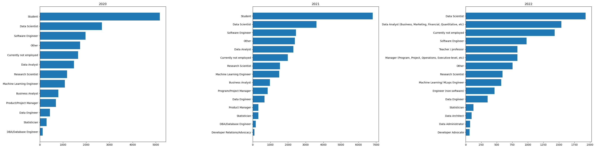
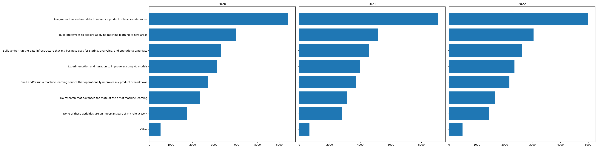
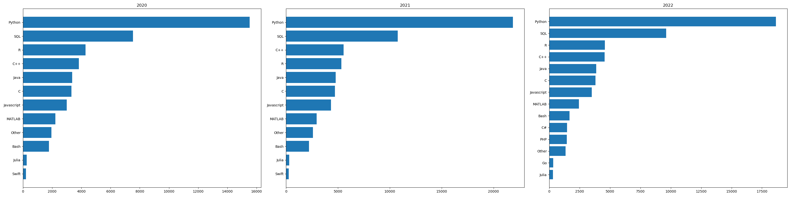
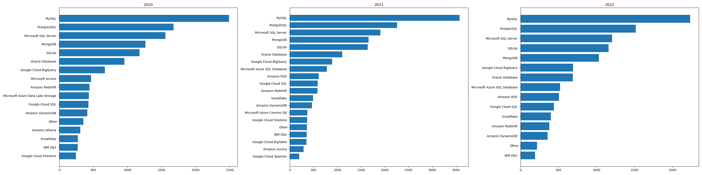
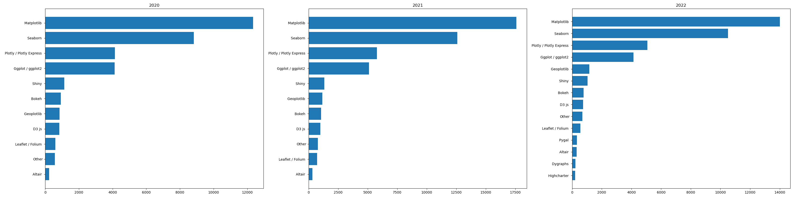
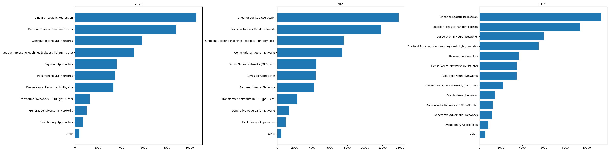

# Project 3: Data Scientists Toolbox

## Introduction

This project, "The Data Scientist's Toolbox," conducts a longitudinal study using the Kaggle Machine Learning and Data Science Survey questionnaires from 2020, 2021, and 2022 hosted on [kaggle.com](https://www.kaggle.com). It performs exploratory analysis to address the following three common questions from beginners.

1. What are the job titles for roles in data science?
2. What are the daily responsibilities of a data science professional?
3. What skills and knowledge are required to pursue a career in data science?

We used `pandas` and `sqlite3` to create a database, and utilized `matplotlib` for proof of concept and final product development.

## How to reproduce

- Install [Miniconda](https://docs.anaconda.com/miniconda)
- Based on `environment.yml` to create environment:

```bash
conda env create -f environment.yml
```

- Put `kaggle_survey_2020_responses.csv`, `kaggle_survey_2021_responses.csv`, `kaggle_survey_2022_responses.csv` to `data/`
- Launch environment and execute `python create_kaggle_survey_db.py` then create `kaggle_survey.db` in folder `data/`
- Launch environment and execute `python create_longitudinal_analysis_plots.py` then you can create six horizontal bar charts.

### What are the job title of data scientists?

Data scientists, Data analyst, Software engineer,...etc.



### What's the daily tasks of data science job?

Analyze and understand data to influence product or business decisions.



### What skills and knowledge of data science job need?

Programming languages: Python, SQL, R, C++



DB: MySQL, PostgreSQL, MS SQL Server, ...etc.



Visualization: Matplotlib, Seaborn, Plotly, ...etc.



ML Algorithm: Linear/Logistic regression, Decision Tree/Random Forrest, Deep Learning, XGBoost, ...etc.

